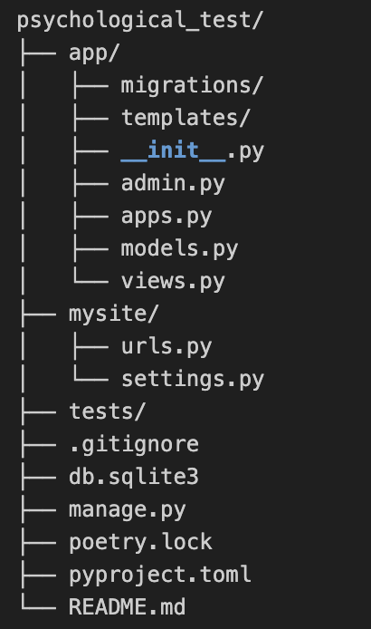

# psychological_test
장고를 이용한 flask 심리프로젝트 

1. 라이브러리

django = "4.0.0" : 웹 어플리케이션을 만들어주는 웹 프레임워크

pandas = "^2.2.2" : 데이터의 분석을 용이하게 해주는 라이브러리로 행렬 형태의 자료구조를 제공하여 results 페이지를 구성

plotly = "^5.23.0" : 데이터를 시각화해주는 라이브러리

2. 파일 구조

app/ : 주요 어플리케이션의 소스코드가 존재하는 폴더
- migrations/ : models.py 파일의 모델들을 Orm을 이용하여 데이터베이스의 테이블로 구성해주는 폴더
- templates/ : html 템플릿 파일 폴더
- admin.py : 관리자 페이지에 등록할 모델을 구성하는 파일
- app.py : Django 애플리케이션의 구성 설정을 정의하는 파일
- models.py : Participacition, Quiz, Question 모델 구성 파일
- views.py : 뷰를 구성하는 파일로 장고에서는 뷰와 라우트를 독립적으로 관리하여 플라스크와 다르게 urls.py파일에서 url을 관리

mysite/ : 장고 프로젝트 수준의 설정과 구성을 담고 있는 디렉토리
- urls.py : 프로젝트의 URL 구성을 정의하는 파일, 이 파일에서는 프로젝트 내의 URL 패턴을 정의하고, 특정 URL 요청이 어떤 뷰로 전달될지 설정 (최상위 경로)
- settings.py : Django 프로젝트의 모든 설정이 포함된 파일. 데이터베이스 설정, 애플리케이션 설정, 미들웨어 설정, 템플릿 설정 등 다양한 설정 관리

3. app/init.py
- flask프로젝트를 django로 재구성하는 중 초기화 과정은 복잡하여 db설정과 admin page는 장고에서 제공해주는 기능을 이용해 구성하였다.

4. models.py
- Participant : 심리테스트의 참가자 모델
- Question : Quiz의 문항 모델
- Quiz : 사용자의 심리테스트 결과를 담는 모델

5. views.py
- models.py에서 설계한 모델을 바탕으로 각 라우트에 대한 뷰를 구성하는 파일
- home -> 참가자 정보 입력 후 제출 -> add_participant -> quiz -> get_questions -> submit -> show_results flow로 구성
- home route : 참가자의 정보를 입력받는 라우트, 제출 시 테스트 시작
- add_participant : 심리 검사가 시작 시 새로운 참가자를 db에 추가하고 quiz page에 참가자의 정보(응답)를 전달
- quiz : 심리 테스트 페이지, 자동으로 get_questions 라우트로 이동하여 각 문항을 가져와 랜더링한다
- get_questions : db에 기록된 Question 레코드를 가져와 랜더링
- submit : 심리 테스트가 끝날 시 참여자 id와 quiz 데이터를 db의 Quiz테이블에 저장, 이후 show_results 뷰로 전환
- show_results : 심리테스트의 결과를 시각화하여 그래프로 랜더링

6. admin.py
- Paticipant, Question, Quiz에 대한 Restapi를 장고에서 자동으로 구성